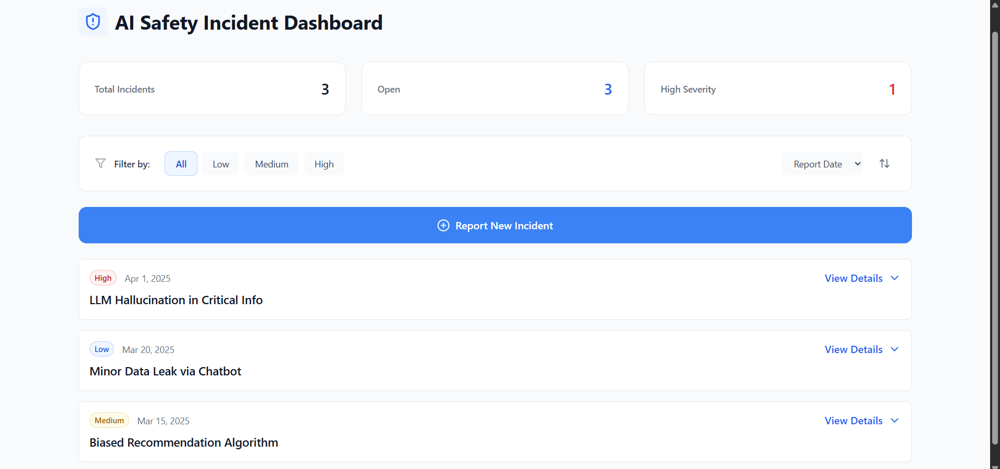

# AI Safety Incident Dashboard

An interactive dashboard for monitoring and managing AI safety incidents, built with React and TypeScript.

<div align="center">
  
</div>

</div>

## Features

- Display a list of AI safety incidents with key information
- Filter incidents by severity (All, Low, Medium, High, Critical)
- Sort incidents by reported date (newest/oldest first)
- Expandable incident details with toggle functionality
- Report new incidents through an interactive form with validation
- Responsive design for all device sizes

## Technology Stack

- **Framework**: React
- **Language**: TypeScript
- **Styling**: Tailwind CSS
- **Date Handling**: date-fns
- **Icons**: lucide-react
- **Build Tool**: Vite

## Getting Started

### Prerequisites

- Node.js (v16 or later)
- npm or yarn

### Installation

1. Clone the repository
```bash
git clone https://github.com/PurnaSaradhi18/AI-Safety-Incident-Dashboard
cd AI-Safety-Incident-Dashboard
```

2. Install dependencies
```bash
npm install
```

3. Start the development server
```bash
npm run dev
```

4. Build for production
```bash
npm run build
```
